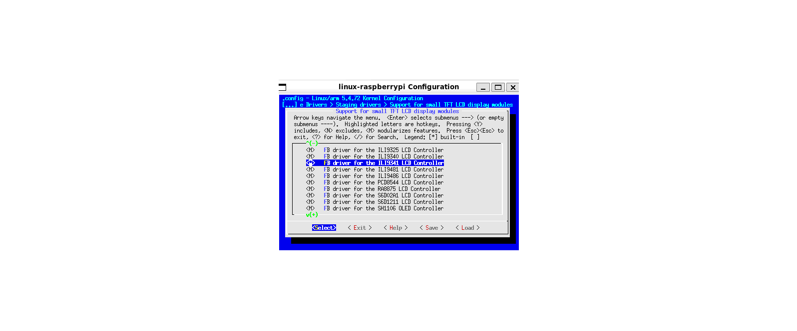

# Bring up màn hinh ili9341
## Set up
- Màn này dùng SPI protocol
- Driver cho màn này đã có sẵn trong kernel. Công việc của chúng ta chỉ cần enable nó lên và thêm nó vào device     tree là được.
- Kết nối chân như dưới:
	- GND - GND
	- VCC - 3.3V
	- CLK - PIN_23 (GPIO_11)
	- MOSI - PIN_19 (GPIO_10)
	- RES - PIN_22 (GPIO_25)
	- DC - PIN_18 (GPIO_24)
	- BLK - 3.3V
	- MISO (không dùng)
- Trong bài này minh dùng màn 8 pin ( mặc định chân Chip select sẽ được kéo xuống 0 luôn)


## Chỉnh sửa device tree và menuconfig
- Sửa file device tree *arch/arm/boot/dts/bcm2708-rpi-zero-w.dts*
```bash
~/yocto/sources/poky/build/workspace/sources/linux-raspberrypi$ git diff
diff --git a/arch/arm/boot/dts/bcm2708-rpi-zero-w.dts b/arch/arm/boot/dts/bcm2708-rpi-zero-w.dts
index f1bbed9fbf73..93c4bdeec712 100644
--- a/arch/arm/boot/dts/bcm2708-rpi-zero-w.dts
+++ b/arch/arm/boot/dts/bcm2708-rpi-zero-w.dts
@@ -100,14 +100,15 @@
        pinctrl-names = "default";
        pinctrl-0 = <&spi0_pins &spi0_cs_pins>;
        cs-gpios = <&gpio 8 1>, <&gpio 7 1>;
+    status = "okay";

-       spidev0: spidev@0{
-               compatible = "spidev";
-               reg = <0>;      /* CE0 */
-               #address-cells = <1>;
-               #size-cells = <0>;
-               spi-max-frequency = <125000000>;
-       };
+//     spidev0: spidev@0{
+//             compatible = "spidev";
+//             reg = <0>;      /* CE0 */
+//             #address-cells = <1>;
+//             #size-cells = <0>;
+//             spi-max-frequency = <125000000>;
+//     };

        spidev1: spidev@1{
                compatible = "spidev";
@@ -116,6 +117,19 @@
                #size-cells = <0>;
                spi-max-frequency = <125000000>;
        };
+    ili9341: fb_ili9341@0 {
+        compatible = "ilitek,ili9341";
+        reg = <0>; /* SPI bus ID, không cần CS */
+        spi-max-frequency = <32000000>; /* Tần số SPI tối đa (32MHz) */
+        rotate = <0>; /* Xoay màn hình (0, 90, 180, 270) */
+        fps = <60>; /* Số khung hình trên giây */
+        buswidth = <8>; /* Giao tiếp 8-bit */
+
+        /* GPIO cho chân DC (Data/Command) và RESET */
+        dc-gpios = <&gpio 24 GPIO_ACTIVE_HIGH>; /* Thay bằng GPIO thực tế của bạn */
+        reset-gpios = <&gpio 25 GPIO_ACTIVE_LOW>; /* Thay bằng GPIO thực tế của bạn */
+        status = "okay";
+    };
 };

 &i2c0if {
```
- Driver của màn này có thể dùng nằm ở đường dẫn *drivers/staging/fbtft/fb_ili9341.c*
- Để biết làm thế nào enable driver này lên thì chúng ta sẽ cùng nhau xem file Kconfig của thư mục *drivers/staging/fbtft/*
```
~/yocto/sources/poky/build/workspace/sources/linux-raspberrypi/drivers/staging/fbtft$ cat Kconfig
# SPDX-License-Identifier: GPL-2.0
menuconfig FB_TFT
        tristate "Support for small TFT LCD display modules"
        depends on FB && SPI && OF
        depends on GPIOLIB || COMPILE_TEST
        select FB_SYS_FILLRECT
        select FB_SYS_COPYAREA
        select FB_SYS_IMAGEBLIT
        select FB_SYS_FOPS
        select FB_DEFERRED_IO
        select FB_BACKLIGHT
..............
config FB_TFT_ILI9341
        tristate "FB driver for the ILI9341 LCD Controller"
        depends on FB_TFT
        help
          Generic Framebuffer support for ILI9341
...................
```
- Đầu tiền là bật *FB_TFT_ILI9341* nhưng driver này lại phụ thuộc vào *FB_TFT* => cần bật cả cờ này lên.
- Tiếp theo ta lại thấy cờ *FB_TFT* phụ thuộc vào *FB* *SPI*(mặc định có built-in sẵn) *OF* (mặc định có sẵn).
- Giờ chúng ta cần bật cả cờ *FB* nữa. Bên cạnh đó, cần bật thêm cờ *SPI_BCM2835* để cho phép spi_master driver hoạt động ( driver này giao tiếp với thanh ghi của SPI)
- Dùng menuconfig để cấu hình các cờ này.
```bash
~/yocto/sources/poky/build/workspace/sources/linux-raspberrypi$ bitbake linux-raspberrypi -c menuconfig
```
- CONFIG_FB


- CONFIG_FB_TFT


- CONFIG_FB_TFT_ILI9341


- CONFIG_SPI_BCM2835


- Sau khi chỉnh xong save lại config 
```
~/yocto/sources/poky/build/workspace/sources/linux-raspberrypi$ bitbake linux-raspberrypi -c savedefconfig
```
## Build lại image rồi test thử
```
~/yocto/sources/poky/build/workspace/sources/linux-raspberrypi$ devtool build linux-raspberrypi
```
```
~/yocto/sources/poky/build/workspace/sources/linux-raspberrypi$ bitbake rpi-basic-image
```
- Log sau khi boot

- Test thử đẩy một ảnh radom ra buffer 
```bash
root@raspberrypi0-wifi:~# cat /dev/urandom  > /dev/fb1
```
- Kết quả

