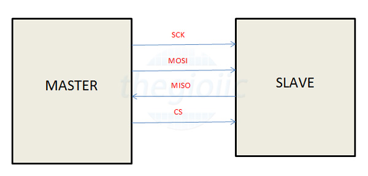

# 1. Tổng quan về giao thức SPI
SPI là một giao thức giao tiếp phổ biến được sử dụng bởi nhiều thiết bị khác nhau. Ví dụ, module thẻ SD, module đầu đọc thẻ RFID và bộ phát / thu không dây 2,4 GHz đều sử dụng SPI để giao tiếp với vi điều khiển.

Lợi ích duy nhất của SPI là dữ liệu có thể được truyền mà không bị gián đoạn. Bất kỳ số lượng bit nào cũng có thể được gửi hoặc nhận trong một luồng liên tục. Với I2C và UART, dữ liệu được gửi dưới dạng gói, giới hạn ở một số bit cụ thể. Điều kiện bắt đầu và dừng xác định điểm bắt đầu và kết thúc của mỗi gói, do đó dữ liệu bị gián đoạn trong quá trình truyền.

Các thiết bị giao tiếp qua SPI có quan hệ Master - Slave. Master là thiết bị điều khiển (thường là vi điều khiển), còn Slave (thường là cảm biến, màn hình hoặc chip nhớ) nhận lệnh từ Master. Cấu hình đơn giản nhất của SPI là hệ thống một Slave, một master duy nhất, nhưng một Master có thể điều khiển nhiều hơn một Slave.

Chi tiết cách thức hoạt động của SPI có thể tham khảo [tại đây](https://dientutuonglai.com/chuan-giao-tiep-spi-la-gi.html)
# 2. SPI protocol driver trong linux
/*** Paste cai anh spi driver vao day */
Protocol driver là tầng làm việc trực tiếp với các thiết bị ngoại vi ( sd card, flash, lcd,..). Dựa theo datasheet của các thiệt bị ngoại vị mà protocol driver sẽ gửi các lệnh để giao tiếp với chúng.

Dưới cùng là tầng hardware, SPI controler driver sẽ có nhiệm vụ giao tiêp với hardware. Driver này thường sẽ do đội làm chíp cung cấp. Kernel sẽ cung cấp cho chúng ta một thư viện spi.h để các protocol driver có thể sử dụng và gọi xuống các hàm của SPI controler driver. Từ các protocol driver này sẽ cung cấp các device file cho user space sử dụng. Người dùng sẽ tương tác với các file này trên user space để điều khiển thiết bị.

SPI protocol driver được linux quản lý thông qua 2 struct
	- struct spi_driver
	- struct spi_device
Các bạn có thể đọc thêm về các struct này trong [link](https://elixir.bootlin.com/linux/v5.4.72/source) 
# 3. Tổng quan Nokia5110
/*ảnh nokia5110*/

Màn hình LCD Nokia 5110 là loại LCD Graphic đơn sắc với số điểm ảnh 84x84 Pixel,với ưu điểm giá thành rẻ, nhỏ gọn, tích hợp đèn nền, sử dụng giao tiếp SPI dễ dàng lập trình và khả năng tiết kiệm năng lượng cao, LCD.
Thông số kỹ thuật:
-	Loại màn hình: LCD Graphic đơn sắc.
-	Mã sản phẩm: Nokia 5110 LCD
-	 Đèn nền: màu trắng
-	Điện áp sử dụng: 3.3~ 5VDC
-	Giao tiếp: SPI

## 3.1. Chức năng chân
1.RST : Chân reset LCD
2. CE: Chân cho phép hoặc không cho phép LCD hoạt động ( 1 số màn ghi là CSE hoặc SE)
3. DC: Chân chọn dữ liệu gửi đến LCD là lệnh hay là dữ liệu để hiển thị ra màn hình
4. CLK: Chân truyền xung nhịp theo chuẩn SPI
5. DIN: Chân dữ liệu data
6. VCC: Chân cấp nguồn cho LCD
7. BL(LED): Chân cấp nguồn cho led nền màn hình LCD
8. GND: Chân mass, cấp nguồn 0V
## 3.2. Cách giao tiếp
- Reset(1) = 0: LCD sẽ bị reset
- LCD chỉ hoạt động khi chân CE = 0.
- Có 2 chế độ làm việc:
	-  DC=0 : Chế độ gửi lệnh, tức là dữ liệu bạn gửi đến có nhiệm vụ điều khiển, cài đặt hoạt động của LCD chứ nó không in ra màn hình
	- DC=1 : Chế độ gửi dữ liệu: Lúc này, tất cả mọi dữ liệu bàn gửi đến sẽ được hiển thị ra màn hình
Xem thêm về cách giao tiếp [tại đây](https://github.com/thanh182790/Learn_yocto/tree/main/03-spi)
## 3.3. Kết nối chân nokia5110 với board Pi zero W
1. RST - PIN_22 (GPIO_25)
2. CE - PIN_24 (GPIO_8)
3. DC - PIN_18 (GPIO_24)
4. DIN - PIN_19 (GPIO_10)
5. CLK - PIN_23 (GPIO_11)
6. VCC - 3.3V
7. BL - 3.3V
8. Gnd - Gnd
# 4. Tích hợp driver Nokia5110 vào kernel
## 4.1. Sử dụng devtool để modify kernel
```bash
~/yocto/sources/poky/build$ devtool modify virtual/kernel
```
## 4.2. Tạo thư mục chứa driver của nokia5110
Trong thư mục *drivers/* của source kernel chúng ta tạo 1 thư mục có tên *nokia5110*
```bash
~/yocto/sources/poky/build/workspace/sources/linux-raspberrypi/drivers$ mkdir nokia5110
```
## 4.3.Viết driver
Trong thự mục *nokia5110* tạo tạo 3 file như dưới đây
```bash
~/yocto/sources/poky/build/workspace/sources/linux-raspberrypi/drivers/nokia5110$ tree
.
├── Kconfig
├── Makefile
└── nokia5110.c
```
### 4.3.1. Source code

```
#include <linux/init.h>
#include <linux/module.h>
#include <linux/kthread.h>
#include <linux/delay.h>
#include <linux/gpio.h>
#include <linux/slab.h>
#include <linux/uaccess.h>
#include <asm/uaccess.h>
#include <linux/spi/spi.h>
#include <linux/cdev.h>

#define LCD_WIDTH               84
#define LCD_HEIGHT              48
#define LCD_CMD                 0
#define LCD_DATA                1
#define MAX_SLAVE               2
#define MAX_BUFF                256

static int nokia5110_open(struct inode *inodep,
                                          struct file *filep);
static int nokia5110_release(struct inode *inodep,
                                                         struct file *filep);
static int nokia5110_write(struct file *filep,
                                                   const char *buf,
                                                   size_t len, loff_t *offset);
static ssize_t nokia5110_read(struct file *filp,
                                                         char __user *buf,
                                                         size_t len,
                                                         loff_t *off);
typedef struct
{
        struct spi_device *nokia5110_spi;
        dev_t nokia5110_dev_num;
        struct class *nokia5110_class;
        struct device *nokia5110_device_p;
        struct cdev nokia5110_cdev;
        char message[MAX_BUFF];
} nokia5110_t;

static struct file_operations fops = {
        .owner      = THIS_MODULE,
        .open = nokia5110_open,
        .release = nokia5110_release,
        .write = nokia5110_write,
        .read = nokia5110_read
};

static const unsigned short ASCII[][5] =
{
        {0x00, 0x00, 0x00, 0x00, 0x00}, // 20
        {0x00, 0x00, 0x5f, 0x00, 0x00}, // 21 !
        {0x00, 0x07, 0x00, 0x07, 0x00}, // 22 "
        {0x14, 0x7f, 0x14, 0x7f, 0x14}, // 23 #
        {0x24, 0x2a, 0x7f, 0x2a, 0x12}, // 24 $
        {0x23, 0x13, 0x08, 0x64, 0x62}, // 25 %
        {0x36, 0x49, 0x55, 0x22, 0x50}, // 26 &
        {0x00, 0x05, 0x03, 0x00, 0x00}, // 27 '
        {0x00, 0x1c, 0x22, 0x41, 0x00}, // 28 (
        {0x00, 0x41, 0x22, 0x1c, 0x00}, // 29 )
        {0x14, 0x08, 0x3e, 0x08, 0x14}, // 2a *
        {0x08, 0x08, 0x3e, 0x08, 0x08}, // 2b +
        {0x00, 0x50, 0x30, 0x00, 0x00}, // 2c ,
        {0x08, 0x08, 0x08, 0x08, 0x08}, // 2d -
        {0x00, 0x60, 0x60, 0x00, 0x00}, // 2e .
        {0x20, 0x10, 0x08, 0x04, 0x02}, // 2f /
        {0x3e, 0x51, 0x49, 0x45, 0x3e}, // 30 0
        {0x00, 0x42, 0x7f, 0x40, 0x00}, // 31 1
        {0x42, 0x61, 0x51, 0x49, 0x46}, // 32 2
        {0x21, 0x41, 0x45, 0x4b, 0x31}, // 33 3
        {0x18, 0x14, 0x12, 0x7f, 0x10}, // 34 4
        {0x27, 0x45, 0x45, 0x45, 0x39}, // 35 5
        {0x3c, 0x4a, 0x49, 0x49, 0x30}, // 36 6
        {0x01, 0x71, 0x09, 0x05, 0x03}, // 37 7
        {0x36, 0x49, 0x49, 0x49, 0x36}, // 38 8
        {0x06, 0x49, 0x49, 0x29, 0x1e}, // 39 9
        {0x00, 0x36, 0x36, 0x00, 0x00}, // 3a :
        {0x00, 0x56, 0x36, 0x00, 0x00}, // 3b ;
        {0x08, 0x14, 0x22, 0x41, 0x00}, // 3c <
        {0x14, 0x14, 0x14, 0x14, 0x14}, // 3d =
        {0x00, 0x41, 0x22, 0x14, 0x08}, // 3e >
        {0x02, 0x01, 0x51, 0x09, 0x06}, // 3f ?
        {0x32, 0x49, 0x79, 0x41, 0x3e}, // 40 @
        {0x7e, 0x11, 0x11, 0x11, 0x7e}, // 41 A
        {0x7f, 0x49, 0x49, 0x49, 0x36}, // 42 B
        {0x3e, 0x41, 0x41, 0x41, 0x22}, // 43 C
        {0x7f, 0x41, 0x41, 0x22, 0x1c}, // 44 D
        {0x7f, 0x49, 0x49, 0x49, 0x41}, // 45 E
        {0x7f, 0x09, 0x09, 0x09, 0x01}, // 46 F
        {0x3e, 0x41, 0x49, 0x49, 0x7a}, // 47 G
        {0x7f, 0x08, 0x08, 0x08, 0x7f}, // 48 H
        {0x00, 0x41, 0x7f, 0x41, 0x00}, // 49 I
        {0x20, 0x40, 0x41, 0x3f, 0x01}, // 4a J
        {0x7f, 0x08, 0x14, 0x22, 0x41}, // 4b K
        {0x7f, 0x40, 0x40, 0x40, 0x40}, // 4c L
        {0x7f, 0x02, 0x0c, 0x02, 0x7f}, // 4d M
        {0x7f, 0x04, 0x08, 0x10, 0x7f}, // 4e N
        {0x3e, 0x41, 0x41, 0x41, 0x3e}, // 4f O
        {0x7f, 0x09, 0x09, 0x09, 0x06}, // 50 P
        {0x3e, 0x41, 0x51, 0x21, 0x5e}, // 51 Q
        {0x7f, 0x09, 0x19, 0x29, 0x46}, // 52 R
        {0x46, 0x49, 0x49, 0x49, 0x31}, // 53 S
        {0x01, 0x01, 0x7f, 0x01, 0x01}, // 54 T
        {0x3f, 0x40, 0x40, 0x40, 0x3f}, // 55 U
        {0x1f, 0x20, 0x40, 0x20, 0x1f}, // 56 V
        {0x3f, 0x40, 0x38, 0x40, 0x3f}, // 57 W
        {0x63, 0x14, 0x08, 0x14, 0x63}, // 58 X
        {0x07, 0x08, 0x70, 0x08, 0x07}, // 59 Y
        {0x61, 0x51, 0x49, 0x45, 0x43}, // 5a Z
        {0x00, 0x7f, 0x41, 0x41, 0x00}, // 5b [
        {0x02, 0x04, 0x08, 0x10, 0x20}, // 5c �
        {0x00, 0x41, 0x41, 0x7f, 0x00}, // 5d ]
        {0x04, 0x02, 0x01, 0x02, 0x04}, // 5e ^
        {0x40, 0x40, 0x40, 0x40, 0x40}, // 5f _
        {0x00, 0x01, 0x02, 0x04, 0x00}, // 60 `
        {0x20, 0x54, 0x54, 0x54, 0x78}, // 61 a
        {0x7f, 0x48, 0x44, 0x44, 0x38}, // 62 b
        {0x38, 0x44, 0x44, 0x44, 0x20}, // 63 c
        {0x38, 0x44, 0x44, 0x48, 0x7f}, // 64 d
        {0x38, 0x54, 0x54, 0x54, 0x18}, // 65 e
        {0x08, 0x7e, 0x09, 0x01, 0x02}, // 66 f
        {0x0c, 0x52, 0x52, 0x52, 0x3e}, // 67 g
        {0x7f, 0x08, 0x04, 0x04, 0x78}, // 68 h
        {0x00, 0x44, 0x7d, 0x40, 0x00}, // 69 i
        {0x20, 0x40, 0x44, 0x3d, 0x00}, // 6a j
        {0x7f, 0x10, 0x28, 0x44, 0x00}, // 6b k
        {0x00, 0x41, 0x7f, 0x40, 0x00}, // 6c l
        {0x7c, 0x04, 0x18, 0x04, 0x78}, // 6d m
        {0x7c, 0x08, 0x04, 0x04, 0x78}, // 6e n
        {0x38, 0x44, 0x44, 0x44, 0x38}, // 6f o
        {0x7c, 0x14, 0x14, 0x14, 0x08}, // 70 p
        {0x08, 0x14, 0x14, 0x18, 0x7c}, // 71 q
        {0x7c, 0x08, 0x04, 0x04, 0x08}, // 72 r
        {0x48, 0x54, 0x54, 0x54, 0x20}, // 73 s
        {0x04, 0x3f, 0x44, 0x40, 0x20}, // 74 t
        {0x3c, 0x40, 0x40, 0x20, 0x7c}, // 75 u
        {0x1c, 0x20, 0x40, 0x20, 0x1c}, // 76 v
        {0x3c, 0x40, 0x30, 0x40, 0x3c}, // 77 w
        {0x44, 0x28, 0x10, 0x28, 0x44}, // 78 x
        {0x0c, 0x50, 0x50, 0x50, 0x3c}, // 79 y
        {0x44, 0x64, 0x54, 0x4c, 0x44}, // 7a z
        {0x00, 0x08, 0x36, 0x41, 0x00}, // 7b {
        {0x00, 0x00, 0x7f, 0x00, 0x00}, // 7c |
        {0x00, 0x41, 0x36, 0x08, 0x00}, // 7d },
        {0x10, 0x08, 0x08, 0x10, 0x08}, // 7e .
        {0x00, 0x06, 0x09, 0x09, 0x06} // 7f .
};

dev_t tmp_dev_num;
nokia5110_t lcd = {};
static int rst_pin = 25;
static int dc_pin = 24;

void nokia5110_init(void);
void nokia5110_clear_screen(void);
void nokia5110_send_byte(bool, unsigned char);
void nokia5110_write_char(char);
void nokia5110_write_string(char *);

void nokia5110_init()
{
        // set GPIOs
        gpio_set_value(rst_pin, 0);
        udelay(2);
        gpio_set_value(rst_pin, 1);

        // init LCD
        nokia5110_send_byte(LCD_CMD, 0x21);     // LCD Extended Commands
        nokia5110_send_byte(LCD_CMD, 0xb1);     // Set LCD Cop (Contrast).      //0xb1
        nokia5110_send_byte(LCD_CMD, 0x04);     // Set Temp coefficent.         //0x04
        nokia5110_send_byte(LCD_CMD, 0x14);     // LCD bias mode 1:48.          //0x13
        nokia5110_send_byte(LCD_CMD, 0x0c);     // LCD in normal mode. 0x0d inverse mode
        nokia5110_send_byte(LCD_CMD, 0x20);
        nokia5110_send_byte(LCD_CMD, 0x0c);

        nokia5110_clear_screen();
}

void nokia5110_send_byte(bool is_data, unsigned char data)
{
        if(is_data)
                gpio_set_value(dc_pin, 1);
        else
                gpio_set_value(dc_pin, 0);

        spi_write(lcd.nokia5110_spi, &data, sizeof(data));
}

void nokia5110_clear_screen()
{
    int i = 0;

        for(i=0; i < LCD_WIDTH * LCD_HEIGHT / 8; i++)
                nokia5110_send_byte(LCD_DATA, 0x00);

        nokia5110_send_byte(LCD_CMD, 0x80 | 0); // set x coordinate to 0
        nokia5110_send_byte(LCD_CMD, 0x40 | 0); // set y coordinate to 0
}

void nokia5110_write_char(char data)
{
    int i = 0;

        nokia5110_send_byte(LCD_DATA, 0x00);
        for(i=0; i < 5; i++)
                nokia5110_send_byte(LCD_DATA, ASCII[data-0x20][i]);
        nokia5110_send_byte(LCD_DATA, 0x00);
}

void nokia5110_write_string(char *data)
{
        /* User space send data always has character LF end of string. So we won't print it to LCD */
        while(*data && *data != 0xA) {
                nokia5110_write_char(*data++);
        }
}

/*
 * Turn on LCD
 */
static int nokia5110_open(struct inode *inodep, struct file *filep)
{
        pr_info("Go to %s, %d\n", __func__, __LINE__);
        return 0;
}

/*
 * Turn off LCD
 */
static int nokia5110_release(struct inode *inodep, struct file *filep)
{
        pr_info("Go to %s, %d\n", __func__, __LINE__);

        filep->private_data = NULL;
        return 0;
}

/*
 * Display Text to LCD
 */
static int nokia5110_write(struct file *filep, const char *buf,
                        size_t len, loff_t *offset)
{
        int ret;
        pr_info("Go to %s, %d\n", __func__, __LINE__);

        memset(lcd.message, 0x0, sizeof(lcd.message));
    if (len > sizeof(lcd.message) - 1) {
        pr_info("Input data too large, truncating...\n");
        len = sizeof(lcd.message) - 1;
    }

    ret = copy_from_user(lcd.message, buf, len);
        if (ret) {
                pr_err("can not copy from user\n");
                return -ENOMSG;
        }
        pr_info("\nUser send: \"%s\"\n", lcd.message);
        nokia5110_clear_screen();
        nokia5110_write_string(lcd.message);

        return len;
}

/*
 * Read Text from LCD
 */
static ssize_t nokia5110_read(struct file *filp, char __user *buf, size_t len, loff_t *off)
{
    ssize_t bytes_to_read = min(len, (size_t)(MAX_BUFF - *off));

    if (bytes_to_read <= 0) {
        pr_info("Data Read: End of file\n");
        return 0; // End of file
    }

    if (copy_to_user(buf, lcd.message + *off, bytes_to_read)) {
        pr_err("Data Read: Err!\n");
        return -EFAULT;
    }

    *off += bytes_to_read;
    pr_info("Data Read: Done!\n");
    return bytes_to_read;
}

static int nokia5110_probe(struct spi_device *spi)
{
        int res = 0;
        int major = MAJOR(tmp_dev_num);
        int minor = spi->chip_select;

/***************** Create Device File In User Space***************/
        lcd.nokia5110_dev_num = MKDEV(major, minor);
        lcd.nokia5110_device_p = device_create(lcd.nokia5110_class, &spi->dev, lcd.nokia5110_dev_num,
                                        &lcd, "nokia5110_%d", minor); /* /dev/nokia5110_0 */
        if (lcd.nokia5110_device_p == NULL) {
                pr_info("Can not create device\n");
                return -1;
        }

        /* Register operations of device */
        cdev_init(&lcd.nokia5110_cdev, &fops);
        lcd.nokia5110_cdev.owner = THIS_MODULE;
        lcd.nokia5110_cdev.dev = lcd.nokia5110_dev_num;

        res = cdev_add(&lcd.nokia5110_cdev, lcd.nokia5110_dev_num, 1);
        if (res) {
                pr_err("error occur when add properties for struct cdev\n");
                goto cdev_add_fail;
        }

    pr_info("Go to %s\n", __func__);
        gpio_request(rst_pin, "RE");
        gpio_request(dc_pin, "DC");
        gpio_direction_output(rst_pin, 0);
        gpio_direction_output(dc_pin, 0);

        lcd.nokia5110_spi = spi;
        nokia5110_init();
        nokia5110_clear_screen();

        pr_info("Nokia5110 Init successfully\n");
        return 0;

cdev_add_fail:
        device_destroy(lcd.nokia5110_class, lcd.nokia5110_dev_num);
        return -1;
}

static int nokia5110_remove(struct spi_device *spi)
{
    pr_info("Remove SPI\n");
    nokia5110_clear_screen();
        return 0;
}

struct of_device_id nokia5110_of_match[] = {
        { .compatible = "nokia5110", 0 },
        {}
};

MODULE_DEVICE_TABLE(of, nokia5110_of_match);

static struct spi_driver my_spi_driver = {
        .probe = nokia5110_probe,
        .remove = nokia5110_remove,
        .driver = {
                .name = "nokia5110",
                .owner = THIS_MODULE,
                .of_match_table = nokia5110_of_match,
        },
};

static int __init func_init(void)
{
        int res = 0;

    pr_info("Go to SPI %s\n", __func__);
        /* Register range device numbers for number of LCD devices */
        res = alloc_chrdev_region(&tmp_dev_num, 0, MAX_SLAVE, "nokia5110_device");
        if (res < 0) {
                pr_info("Error occur, can not register major number\n");
                goto alloc_dev_failed;
        }

        /* Create the class for all of LCD Devices */
        lcd.nokia5110_class = class_create(THIS_MODULE, "nokia5110_class");
        if (lcd.nokia5110_class == NULL) {
                pr_info("Error occur, can not create class device\n");
                goto create_class_failed;
        }

        /* Register spi_driver - protocol driver */
        res = spi_register_driver(&my_spi_driver);
        if (res < 0) {
                goto spi_register_failed;
        }

        pr_info("Go out SPI %s\n", __func__);
        return res;

spi_register_failed:
        class_destroy(lcd.nokia5110_class);
create_class_failed:
        unregister_chrdev_region(tmp_dev_num, MAX_SLAVE);
alloc_dev_failed:
        return res;
}

static void __exit func_exit(void)
{
    pr_info("Remove function SPI d%s\n", __func__);
    cdev_del(&lcd.nokia5110_cdev);
        device_destroy(lcd.nokia5110_class, lcd.nokia5110_dev_num);
    class_destroy(lcd.nokia5110_class);
    unregister_chrdev_region(tmp_dev_num, MAX_SLAVE);

        return spi_unregister_driver(&my_spi_driver);
}

module_init(func_init);
module_exit(func_exit);

MODULE_AUTHOR("Devlinux");
MODULE_LICENSE("GPL");
```
### 4.3.2. Makefile
```bash
~/yocto/sources/poky/build/workspace/sources/linux-raspberrypi/drivers/nokia5110$ cat Makefile
obj-$(CONFIG_NOKIA5110) += nokia5110.o
```
### 4.3.1. Kconfig
```bash
~/yocto/sources/poky/build/workspace/sources/linux-raspberrypi/drivers/nokia5110$ cat Kconfig
config NOKIA5110
    tristate "Module SPI NOKIA 5110"
    default y
    help
      This is driver for module SPI NOKIA 5110.
```
## 4.4. Sửa file Kconfig và Makefile ở drivers/
Trong thư mục drivers/ thêm dòng sau vào file Kconfig
```bash
source "drivers/nokia5110/Kconfig"
```
Thêm dòng sau vào file Makefile ( built-in)
```bash
obj-$(CONFIG_NOKIA5110) += nokia5110/
```
Sau khi sửa, chúng ta có thể build lại file .config bằng lệnh:
```bash
~/yocto/sources/poky/build/workspace/sources/linux-raspberrypi/drivers$ bitbake linux-raspberrypi -c menuconfig
```
Một menuconfig sẽ hiện ra để chúng ta có thể cấu hình thay đổi build-in hay build module cho driver.
Sau đó, lưu lại và chạy lệnh sau để lưu lại file defconfig
```bash
~/yocto/sources/poky/build/workspace/sources/linux-raspberrypi/drivers$ bitbake linux-raspberrypi -c savedefconfig
```
## 4.5. Khai báo nokia5110 trong device tree
Sửa file *~/yocto/sources/poky/build/workspace/sources/linux-raspberrypi/arch/arm/boot/dts/bcm2708-rpi-zero-w.dts*
```
&spi0 {
        pinctrl-names = "default";
        pinctrl-0 = <&spi0_pins &spi0_cs_pins>;
        cs-gpios = <&gpio 8 1>, <&gpio 7 1>;
//      spidev0: spidev@0{
//              compatible = "spidev";
//              reg = <0>;      /* CE0 */
//              #address-cells = <1>;
//              #size-cells = <0>;
//              spi-max-frequency = <125000000>;
//      };
    status = "okay";
    nokia5110: nokia5110@0 {
        compatible = "nokia5110";
        reg = <0x0>;
        spi-max-frequency = <4000000>;
        status = "okay";
    };
        spidev1: spidev@1{
                compatible = "spidev";
                reg = <1>;      /* CE1 */
                #address-cells = <1>;
                #size-cells = <0>;
                spi-max-frequency = <125000000>;
        };
};
```
# 5. Viết app test
```bash
~$ cat app_nokia5110.cpp
#include <iostream>
#include <fstream>
#include <string>
#include <fcntl.h>
#include <unistd.h>
#include <cstring>
#include <errno.h>
using namespace std;

void writeToFile(int fd) {
    string data;
    cout << "Enter the data to write:";
    cin.ignore(); // Clear the input buffer
    getline(cin, data);

    ssize_t bytesWritten = write(fd, data.c_str(), data.size());
    if (bytesWritten == -1) {
        cerr << "Error writing to file: " << strerror(errno) << endl;
    } else {
        cout << "Successfully wrote " << bytesWritten << " bytes: " << data << endl;
    }
}

void readFromFile(int fd) {
    char buffer[256];
    ssize_t bytesRead = read(fd, buffer, sizeof(buffer) - 1);
    if (bytesRead == -1) {
        cerr << "Error reading from file: " << strerror(errno) << endl;
    } else {
        buffer[bytesRead] = '\0'; // Null-terminate the buffer
        cout << "Read " << bytesRead << " bytes: " << buffer << endl;
    }
}

int main() {
    const char* device = "/dev/nokia5110_0";
    int fd = open(device, O_RDWR); // Open file with read/write permissions

    if (fd == -1) {
        cerr << "Error opening " << device << ": " << strerror(errno) << endl;
        return 1;
    }

    int choice = 0;
    do {
        std::cout << "\nChoose an option:\n"
                  << "1. Write to file\n"
                  << "2. Read from file\n"
                  << "3. Exit\n"
                  << "Enter your choice: ";
        cin >> choice;

        switch (choice) {
            case 1:
                writeToFile(fd);
                break;
            case 2:
                readFromFile(fd);
                break;
            case 3:
                cout << "Exiting program." << endl;
                break;
            default:
                cout << "Invalid choice. Please try again." << endl;
        }
    } while (choice != 3);

    close(fd);
    return 0;
}
```
# 6. Sửa file local.conf để tích hợp sdk vào image
Thêm dòng này vào file local.conf
```
IMAGE_FEATURES:append = " tools-sdk"
```
# 7. Build sdk để cross compile trên máy host
Xem hướng dẫn [tại đây](https://github.com/thanh182790/Learn_yocto/blob/main/document/build_SDK_yocto.md)
# 8. Build lại kernel, image và app
```bash
~/yocto/sources/poky/build/workspace/sources/linux-raspberrypi/arch/arm/boot/dts$ devtool build linux-raspberrypi
```
```bash
~/yocto/sources/poky/build/workspace/sources/linux-raspberrypi/arch/arm/boot/dts$ bitbake core-image-minimal
```
```bash
~$ $CXX -o ~/app_nokia5110 ~/app_nokia5110.cpp
```
Sau khi build xong, copy flash image nằm vào thẻ nhớ. Sau đó, copy file binary của app sang board để chạy thử

# 5. Kết quả
Sau khi khởi động thiết bị xong check log thấy hàm probe đã được gọi

